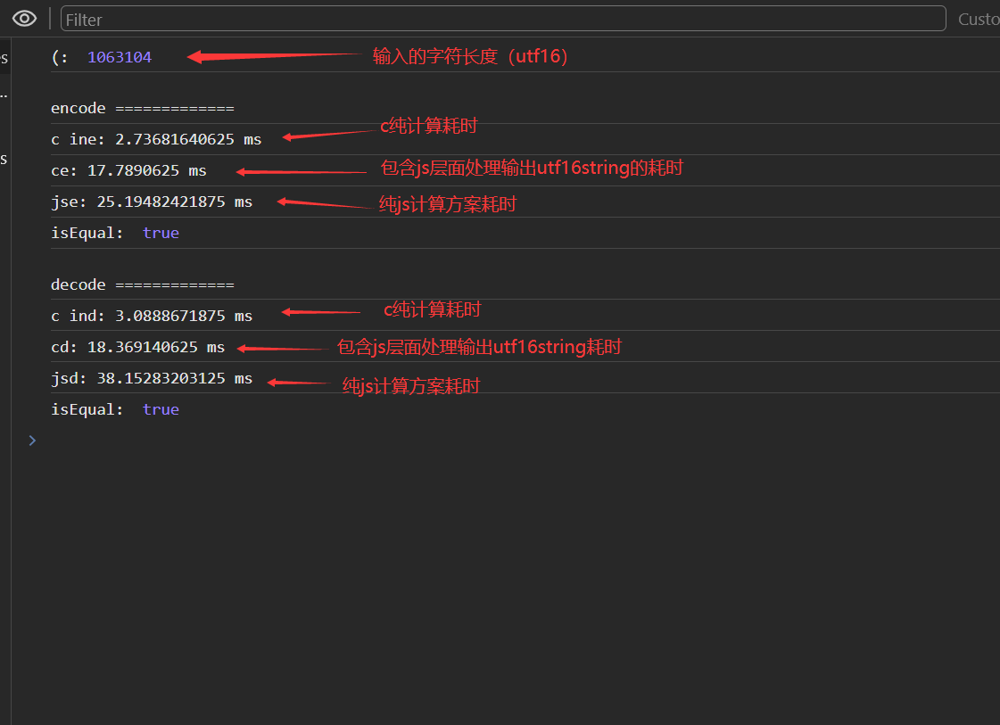

# base64编解码器

由c语言实现的WebAssembly base64编解码器。   

纯打包后的wasm计算速度比js快5-10倍，但是由于js层面要读写内存、字符编码转换等操作；在较小的数据面前整体不如纯js方案<sup>`*1`</sup>计算快，当数据较大时比纯js方案要快。 

<sup>`*1`</sup>: 对比中的纯js方案采用开源库 [js-base64](https://www.npmjs.com/package/js-base64)

较大数据测试结果：     


# 预览  
`npm run preview` -> 浏览器打开 http://127.0.0.1:8080/examples/wasm.html

# 集成
项目引入即可，采用esm模块系统。  

# API
```ts
  type ResultDescriptor = {
    string: string;
    buffer: Uint8Array;
  }
  
  declare module "base64codec-wasm" {
    export default function (): Promise<{ 
        encode: (source: Uint8Array | string) => ResultDescriptor; 
        decode: (source: Uint8Array | string) => ResultDescriptor;
    }>;
  }
```

# others
另一个js实现的base编解码： [https://github.com/lilindog/base64-helper](https://github.com/lilindog/base64-helper)  